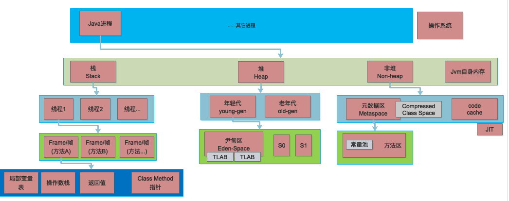
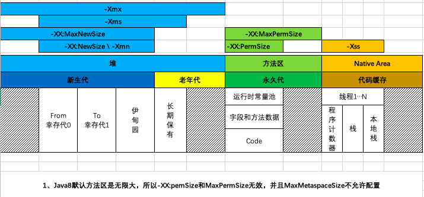

### Part-1:字节码学习
- 编译和查看字节码文件命令
```
javac ***.java             #编译文件
javap -verbose ***.class   #查看编译后文件字节码
```

- 条件判断
<br/>if_icmpge #标号 比较条件，不合法跳转到相应标号
<br/>iflt 栈顶值小于0 则跳转到相关标号
<br/>ifeq #标号 判断是否为空，为空跳转相应标号

- 栈操作
<br/>ldc 常数到操作数栈
<br/>sipush 将短整形推送到栈顶
<br/>iload 本地变量到操作数栈
<br/>istore 操作数栈到本地变量

- 循环操作
<br/>for循环
```
 7: astore_1
 8: iconst_0
 9: istore_2
10: iload_2
11: aload_1
12: invokeinterface #4,  1            // InterfaceMethod java/util/List.size:()I
17: if_icmpge     40
20: getstatic     #5                  // Field java/lang/System.out:Ljava/io/PrintStream;
23: aload_1
24: invokeinterface #6,  1            // InterfaceMethod java/util/List.toArray:()[Ljava/lang/Object;
29: iload_2
30: aaload
31: invokevirtual #7                  // Method java/io/PrintStream.println:(Ljava/lang/Object;)V
34: iinc          2, 1
37: goto          10
``` 
for元素遍历：字节码层面用的是Iterator进行处理的
```
48: aload_1
49: invokeinterface #10,  1           // InterfaceMethod java/util/List.iterator:()Ljava/util/Iterator;
54: astore_2
55: aload_2
56: invokeinterface #11,  1           // InterfaceMethod java/util/Iterator.hasNext:()Z
61: ifeq          84
64: aload_2
65: invokeinterface #12,  1           // InterfaceMethod java/util/Iterator.next:()Ljava/lang/Object;
70: checkcast     #13                 // class java/lang/String
73: astore_3
74: getstatic     #5                  // Field java/lang/System.out:Ljava/io/PrintStream;
77: aload_3
78: invokevirtual #9                  // Method java/io/PrintStream.println:(Ljava/lang/String;)V
81: goto          55
```
list.foreach：采用的是调用动态代码进行操作
```
92: aload_1 
93: invokedynamic #15,  0             // InvokeDynamic #0:accept:()Ljava/util/function/Consumer;
98: invokeinterface #16,  2           // InterfaceMethod java/util/List.forEach:(Ljava/util/function/Consumer;)V
103: return
```

- 跳转
goto #标号 跳转

- 异常处理
```
Code:
  stack=2, locals=2, args_size=1
     0: iconst_1
     1: iconst_0
     2: idiv
     3: istore_1
     4: goto          12
     7: astore_1
     8: aload_1
     9: invokevirtual #28                 // Method java/lang/Exception.printStackTrace:()V
    12: return
  Exception table:
     from    to  target type
         0     4     7   Class java/lang/Exception
```
Exception table 定义开始0 到 4 发生Exception异常将跳转到标号为7的地方
- switch操作
```
Code:
  stack=2, locals=4, args_size=1
     0: ldc           #2                  // String 1
     2: astore_1
     3: aload_1
     4: astore_2
     5: iconst_m1
     6: istore_3
     7: aload_2
     8: invokevirtual #3                  // Method java/lang/String.hashCode:()I
    11: tableswitch   { // 97 to 99  97 为字母"a" 98为字母"b" 
                  97: 36
                  98: 50
                  99: 64
             default: 75
        }
    36: aload_2
    37: ldc           #4                  // String a
    39: invokevirtual #5                  // Method java/lang/String.equals:(Ljava/lang/Object;)Z
    42: ifeq          75
    45: iconst_0
    46: istore_3
    47: goto          75
    50: aload_2
    51: ldc           #6                  // String b
    53: invokevirtual #5                  // Method java/lang/String.equals:(Ljava/lang/Object;)Z
    56: ifeq          75
    59: iconst_1
    60: istore_3
    61: goto          75
    64: aload_2
    65: ldc           #7                  // String c
    67: invokevirtual #5                  // Method java/lang/String.equals:(Ljava/lang/Object;)Z
    70: ifeq          75
    73: iconst_2
    74: istore_3
    75: iload_3
    76: tableswitch   { // 0 to 2
                   0: 104
                   1: 115
                   2: 115
             default: 123
        }
   104: getstatic     #8                  // Field java/lang/System.out:Ljava/io/PrintStream;
   107: ldc           #4                  // String a
   109: invokevirtual #9                  // Method java/io/PrintStream.println:(Ljava/lang/String;)V
   112: goto          123
   115: getstatic     #8                  // Field java/lang/System.out:Ljava/io/PrintStream;
   118: ldc           #6                  // String b
   120: invokevirtual #9                  // Method java/io/PrintStream.println:(Ljava/lang/String;)V
   123: return
```
备注：String类型为Swtich类型时，先根据HashCode进行匹配，匹配进入相关字节码块中，会再一次进行String.equals比较。
- 样例：System.out.print("")
```
getstatic           #5     // Field java/lang/System.out:Ljava/io/PrintStream;
40: ldc             #18    // String middle value
42: invokevirtual   #9     // Method java/io/PrintStream.println:(Ljava/lang/String;)V
```

### Part-2：JVM内存模型
- 内存模型


- 各参数影响范围


### Part-3：JVM启动常用参数
- JVM参数使用-开头，
    - -D 设置系统属性 
    - -X开头为非标准参数，可以通过java -X查看JVM支持该类型参数类型
    - -XX开头为非稳定参数，专门用于控制JVM行为 
    - -XX: +-Flags形式，对布尔值进行开关 -XX：key=value形式，指定某个选项的值

下面根据参数类型分类进行描述：
- 系统属性参数
<br/>该类型参数与windows环境下配置环境变量类似，也可以通过java中System类进行操作。
```java
System.setProperty("a","test");
System.out.println(System.getProperty("a"));
```
- 运行模式参数
    - -server:设置 JVM 使用 server 模式，特点是启动速度比较慢，但运行时性能和内存管理效率 很高，适用于生产环境。
    - -client:设置 JVM 使用 client 模 式，特点是启动速度比较快，但运行时性能和内存管理效率不高，通常用于客户端应用程序或 者 PC 应用开发和调试。
    - -Xmixed:混合模式执行 (默认)
    - -Xint:仅解释模式执行,强制 JVM 解释执行所有的字节 码，这当然会降低运行速度，通常低10倍或更多
    - -Xcomp:-Xcomp 参数与-Xint 正好相反，JVM 在第一次使用时会把所有的字节码编译成本地 代码，从而带来最大程度的优化。【注意预热】
- 堆内存设置参数
    - -Xms<size>        设置初始 Java 堆大小
    - -Xmx<size>        设置最大 Java 堆大小
    - -Xss<size>        设置 Java 线程堆栈大小
    - -Xmn 等价于-XX:NewSize ，G1垃圾回收器无需指定，官方建议设置为 -Xmx 的 1/2 ~ 1/4
    - -XX:MaxPermSize=size,Java8 默认允许的 Meta空间无限大，此参数无效。
    - -XX:MaxMetaspaceSize=size, Java8 默认不限制 Meta 空间, 一般不允许设置该选项。
    - -XX:MaxDirectMemorySize=size，系统可以使用的最大堆外内存，这个参 数跟 -Dsun.nio.MaxDirectMemorySize 效果相同。
    - -Xss, 设置每个线程栈的字节数。 例如 -Xss1m 指定线程栈为 1MB，与- XX:ThreadStackSize=1m 等价
- GC设置参数
    - -XX:+UseG1GC:使用G1垃圾回收器 
    - -XX:+UseConcMarkSweepGC:使用CMS垃圾回收器 
    - -XX:+UseSerialGC:使用串行垃圾回收器 
    - -XX:+UseParallelGC:使用并行垃圾回收器
    - -XX:+UnlockExperimentalVMOptions -XX:+UseZGC    // Java 11+
    - -XX:+UnlockExperimentalVMOptions -XX:+UseShenandoahGC   // Java 12+
- 分析诊断参数
    - -XX:+-HeapDumpOnOutOfMemoryError当OutOfMemoryError产生，即内存溢出(堆内存或持久代)时，自动 Dump 堆内存。示例用法如下:
    ```
    java -XX:+HeapDumpOnOutOfMemoryError -Xmx256m ConsumeHeap
    ```  
    - -XX:HeapDumpPath 选项, 与 HeapDumpOnOutOfMemoryError 搭配使用, 指定内存溢出时 Dump 文件的目 录。
    - -XX:ErrorFile=filename 致命错误的日志文件名,绝对路径或者相对路径。
    - -XX:OnError 选项, 发生致命错误时(fatal error)执行的脚本。
- JavaAgent参数
    - 后续研究
   