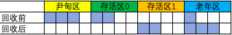
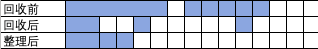
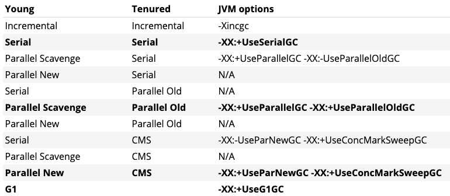

### Part-1：对象已死判定方法
- 引用计数法
在对象中添加一个引用计数器，每当有一个地方引用，计数器值就加1，当引用失效时，计数器就减1；
任何时候计数器为0的对象就是不可能再被引用的。Java虚拟机并不是通过这个方式处理的。
<br/>优点：原理简单、判定效率高
<br/>缺点：循环引用

- 可达性分析法
通过一系列称为"GC Roots"的根对象作为起始节点集，从这些节点开始，根据引用关系向下搜索，搜索过程走过的路径称为"引用链"。
固定作为GC Root的对象包括：
    - 在虚拟机栈（栈帧中的本地变量表）中引用的对象，如各个线程调用的方法堆栈中使用的参数、局部变量、临时变量等
    - 在方法区中类静态属性引用对象，譬如Java类的引用静态类型变量
    - 在方法区中常量引用的对象，譬如字符串常量池（String Table）里的引用
    - 在本地方法栈中JNI（本地native方法）引用的对象
    - Java虚拟机内部的引用，比如基本数据类型对应的Class对象，一些常驻的异常对象，系统类加载器
    - 所有被同步锁（sychronized关键字）持有对象
    - 反映Java虚拟机内部情况JMXBean、JVMTI中注册的回调、本地代码缓存等
- 引用
    - 强引用：如Object A=new Object()这种引用关系，只要引用关系还存在，垃圾收集器就永远不会回收掉被引用的对象。
    - 软引用：软引用描述一些还有用，但是非必须对象，只被软引用关联的对象，在系统将发生内存溢出异常前，会把这些对象列进回收范围内进行二次回收，如果这次
    回收还没有足够内存，才会抛出溢出异常，Java使用SoftReference
    - 弱引用：描述一些还有用，但是非必须对象，只能生存到下一次垃圾收集器发生为止。WeakReference
    - 虚引用：一个对象是否有虚引用的存在，完全不会对其生存时间构成影响。为一个对象设置虚引用关联的唯一目的只是为了能在这个对象
    被收集器回收时收到一个系统通知。
### Part-2：垃圾收集算法
- 标记-清除<br/>

<br/>首先标记需要回收或存活对象，然后统一回收被标记或未标记的对象，标记过程是对象是对象是否属于垃圾的判定。
缺点如下：
   - 执行效率不稳定，随着对象增加需要标记和清除的对象居多，导致回收时间增加第二
   - 内存碎片化问题，标记清除后导致大量不连续的内存碎片，空间碎片化太多可能会导致以后程序运行过程中大对象无法找到足够的连续空间而提前触发另一次垃圾回收动作。

- 标记-复制<br/>

<br/>将内存空间分为两块，将第一块还在使用的对象复制到第二块，然后释放第一块,分配内存时不用考虑有空间碎片的复杂情况，只要移动堆顶指针。
缺点如下：
    - 大量对象存活就需要复制很多对象
    - 空间使用上只有原来空间的一半

- 标记-整理<br/>

<br/>在标记-清除算法后多一步将存活对象都向内存空间一端移动宠儿实现整理。不整理在内存分配上更复杂，整理则回收时会更复杂。

### Part-3：常见垃圾收集触发时机
Minor GC(young GC)触发时机：
- JVM无法为新对象分配空间时（例如Eden变满），总是会触发次要GC。因此，分配率越高，次要GC发生的频率就越高

Full GC触发时机：
- 系统调用System.GC()进行触发
- 通过Minor GC后进入老年代的平均大小大于老年代的可用内存
- 由Eden区、From Space区向To Space区复制时，对象大小大于To Space可用内存，则把该对象转存到老年代，且老年代的可用内存小于该对象大小
- 方法区(永久代)空间不足

### Part-4：常见垃圾收集器
- 常用GC组合及配置


#### 第一类：串型GC
- Serial /SerialOld
<br/>新生代采取标记-复制算法，老年代采取标记-整理算法，需要停止所有业务线程

- ParNew
<br/>新生代采取标记-复制算法（可并发）,需要停止所有业务线程。
ParNew是CMS默认的新生代收集器，启动参数：-XX:+UseParNewGC,执行日志如下
```
2020-10-21T23:43:21.440-0800: [GC (Allocation Failure) 2020-10-21T23:43:21.440-0800: 
[ParNew: 52667K->1186K(59008K), 0.0123765 secs] 65358K->13886K(124544K), 0.0124545 secs] 
[Times: user=0.01 sys=0.00, real=0.01 secs]
```
#### 第二类：并行GC（Parallel Scavenge/Parallel Old）
新生代采用标记-复制算法，老年代采用标记-整理算法，需要停止所有业务线程。
吞吐量=运行用户代码时间/(运行用户代码时间+运行垃圾收集时间)
    - -XX:GCTimeRatio参数值为0～100的整数，给虚拟机设定一个优化目标
    - -XX:+UseAdaptiveSizePolicy 启用则不需要人工指定各个区大小，晋升老年代对象大小参数
    - -XX:MaxGCPauseMillis 最大GC停止时间
    - -XX:ParallelGCThreads GC线程数，默认是处理器核数
    - -XX:+UseParallelGC -XX:-UseParallelOldGC

    特点如下：
    - 在用户线程工作没有任何GC线程工作可以将所有运算能力放在业务处理环节
    - 在 GC 期间，CPU 内核都在并行清理垃圾，总暂停时间更短;
    
#### 参考资料：
1、https://plumbr.io/handbook/garbage-collection-algorithms-implementations#cms-minor-gc
<br/>2、深入理解Java虚拟机--周志明


### Part-4：后期垃圾收集器
- ZGC
- Shenandoah


### Part-3：HotSpot的算法细节实现
- 根节点枚举
<br/>迄今为止，所有收集在根节点枚举这个步骤是必须暂停用户线程的。而要做到不用一个不漏的从方法区等GC Root开始查找，HotSpot用OopMap来实现这个优化。
一旦类加载动作完成，HotSpot就会把对象内什么偏移量是什么类型的数据计算出来，在即时编译过程中也会在特定位置记录下栈里和寄存器里那些位置是引用。

- 安全点
- 安全区域
- 记忆集与卡表
- 写屏障
- 并发的可达性分析