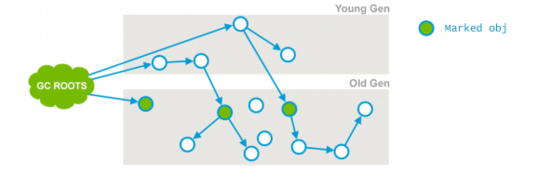
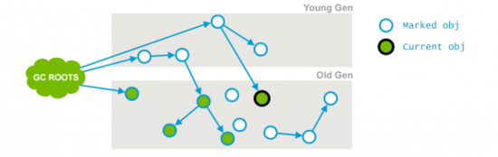
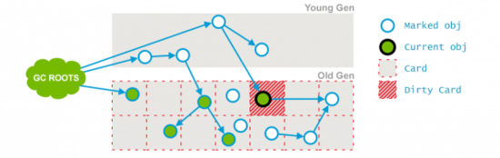
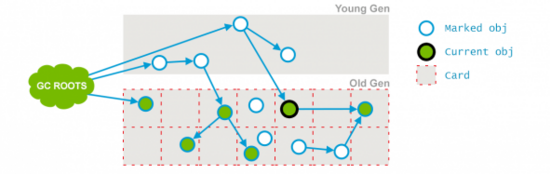
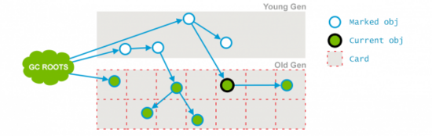

CMS GC 的设计目标是避免在老年代垃圾收集时出现长时间的卡顿，主要通过两种手段来达成：
<br/>1、不对老年代进行整理，而是使用空闲列表(free-lists)来管理内存空间的回收
<br/>2、在 mark-and-sweep (标记-清除) 阶段的大部分工作和应用线程一起并发执行。
<br/>启动参数：
```
#使用CMS垃圾收集器
-XX:UseConcMarkSweepGC              

#每一次FullGC之后进行一次碎片整理（默认开启） Java9废弃参数
-XX:+UseCMSCompactAtFullCollection 

#要求CMS执行若干次后不执行碎片整理，在进入FullGC前进行碎片整理，
#（默认是0，表示每次进入FullGC前都进行垃圾整理
-XX:+CMSFullGCsBeforeCompaction  

#配置老年代使用率触发CMS，JDK-5是62% JDK-6是92%
-XX:CMSInitiatingOccu-pancyFraction    

#是否启用类卸载功能，默认是不允许
-XX:+CMSClassUnloadingEnabled 

#是否清理永久代，在java6过后就废弃了这个参数，如果添加启动项目会提示
#Please use CMSClassUnloadingEnabled in place of CMSPermGenSweepingEnabled in the future

-XX:+CMSPermGenSweepingEnabled 
```
CMS收集器7阶段：
    
- 阶段1：初始标记

<br/>初始标记是所有的根对象，以及被年轻代中所有存活对象引用的对象（老年代单独回收），所有业务线程停止 

- 阶段2：并发标记

<br/>通过遍历第一个阶段（Initial Mark）标记出来的存活对象，继续递归遍历老年代，并标记可直接或间接到达的所有老年代存活对象
<br/>在并发标记阶段， 应用线程和GC线程是并发执行的，因此可能产生新的对象或对象关系发生变化 ，例如：
     新生代的对象晋升到老年代；
     直接在老年代分配对象；
     老年代对象的引用关系发生变更；对于这些对象，需要重新标记以防止被遗漏。 为了提高重新标记的效率，本阶段会把这些发生变化的对象所在的Card标识为Dirty ，这样后续就只需要扫描这些Dirty Card的对象，从而避免扫描整个老年代。

- 阶段3：并发预清理


<br/>将会重新扫描前一个阶段标记的Dirty对象，并标记被Dirty对象直接或间接引用的对象，然后清除Card标识 。

- 阶段4：可中止的并发预清理
这个阶段是尽量为下一个步骤减轻任务，默认时间是5s期望在时间内做一次YGC，从而减少下一次STW的时候扫描标记新生代引用老年代的对象个数。
<br/>由于这个阶段是循环的做两件事直到发生abort的条件，如：重复的次数、多少量的工作、持续的时间等：
    - 处理 From 和 To 区的对象，标记可达的老年代对象；
    - 和上一个阶段一样，扫描处理Dirty Card中的对象。
    
- 阶段5：最终标记
    - 遍历新生代对象，重新标记；（新生代会被分块，多线程扫描）
    - 根据GC Roots，重新标记；
    - 遍历老年代的Dirty Card，重新标记。这里的Dirty Card，大部分已经在Preclean阶段被处理过了。

- 阶段6：并发清除

<br/>并发清理阶段，主要工作是 清理所有未被标记的死亡对象，回收被占用的空间

- 阶段7：并发重置
<br/>将清理并恢复在CMS GC过程中的各种状态，重新初始化CMS相关数据结构，为下一个垃圾收集周期做好准备。
CSM执行日志：
```
2020-10-21T23:42:56.214-0800: [CMS-concurrent-mark-start]
2020-10-21T23:42:56.245-0800: [CMS-concurrent-mark: 0.031/0.031 secs] [Times: user=0.03 sys=0.00, real=0.03 secs]
2020-10-21T23:42:56.245-0800: [CMS-concurrent-preclean-start]
2020-10-21T23:42:56.246-0800: [CMS-concurrent-preclean: 0.001/0.001 secs] [Times: user=0.00 sys=0.00, real=0.00 secs]
2020-10-21T23:42:56.246-0800: [CMS-concurrent-abortable-preclean-start]
 CMS: abort preclean due to time 2020-10-21T23:43:01.313-0800: [CMS-concurrent-abortable-preclean: 0.110/5.066 secs] [Times: user=0.15 sys=0.01, real=5.07 secs]
2020-10-21T23:43:01.313-0800: [GC (CMS Final Remark) [YG occupancy: 20889 K (59008 K)]2020-10-21T23:43:01.313-0800: [Rescan (parallel) , 0.0032949 secs]2020-10-21T23:43:01.316-0800: [weak refs processing, 0.0000792 secs]2020-10-21T23:43:01.317-0800: [class unloading, 0.0305113 secs]2020-10-21T23:43:01.347-0800: [scrub symbol table, 0.0108352 secs]2020-10-21T23:43:01.358-0800: [scrub string table, 0.0009403 secs][1 CMS-remark: 13558K(65536K)] 34447K(124544K), 0.0464377 secs] [Times: user=0.03 sys=0.02, real=0.04 secs]
2020-10-21T23:43:01.360-0800: [CMS-concurrent-sweep-start]
2020-10-21T23:43:01.367-0800: [CMS-concurrent-sweep: 0.007/0.007 secs] [Times: user=0.00 sys=0.00, real=0.00 secs]
2020-10-21T23:43:01.367-0800: [CMS-concurrent-reset-start]
2020-10-21T23:43:01.367-0800: [CMS-concurrent-reset: 0.000/0.000 secs] [Times: user=0.00 sys=0.00, real=0.00 secs]
```

#### 参考资料：
1、https://www.codercto.com/a/45937.html
2、https://plumbr.io/handbook/garbage-collection-algorithms-implementations#cms-minor-gc